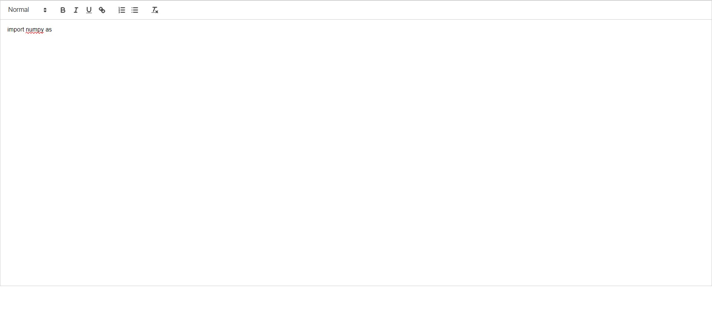

# Resume Parser using Spacy
Autocompletion made using spacy, flask and react js to extract skills and education

# TO RUN THE APPLICATION FOR FIRST TIME
## Installation in Frontend Folder

```bash
cd auto-completion/frontend
npm install 
npm start
```

## Installation in Backend Folder

```bash
py -3 -m venv venv
venv\Scripts\activate
pip install -r requirements.txt
```

# Code Editor


