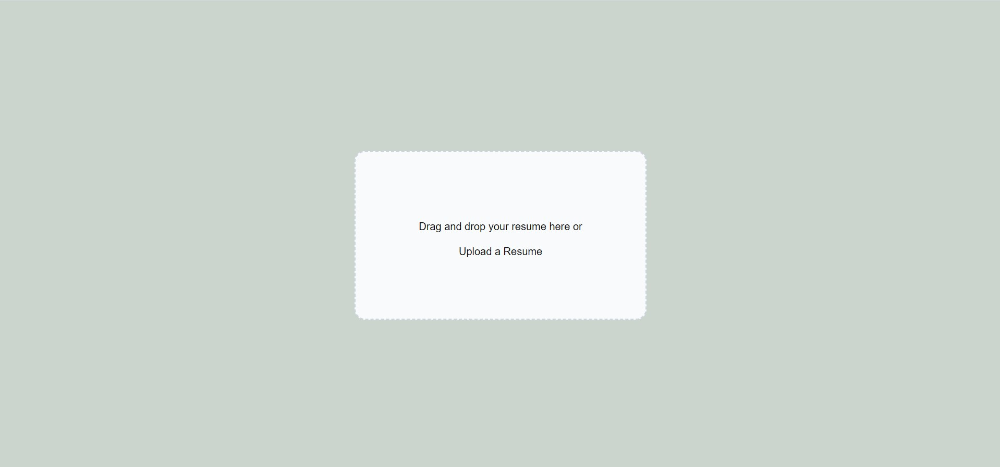
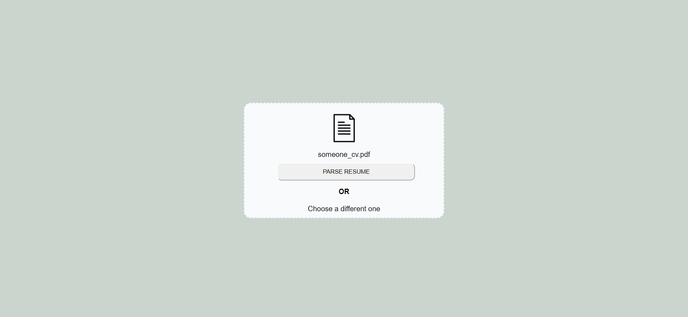

# Resume Parser using Spacy
Resume parser made using spacy, flask and react js to extract skills and education

# TO RUN THE APPLICATION FOR FIRST TIME
## Installation in Frontend Folder

```bash
cd resume-parser
npm install 
npm start
```

## Installation in Backend Folder

```bash
py -3 -m venv venv
venv\Scripts\activate
pip install -r requirements.txt
```


# Main Page 



# After uploading the CV


# Education and Skills extracted


# To do in Future
1) Extract more information from education field like university, started year and graduated year
2) Add more fields like emails, work history and so on.
3) Add download as csv, xlsx or json feature
4) Add multiple file parsing feature and support docx and image extensions
5) Many more.
