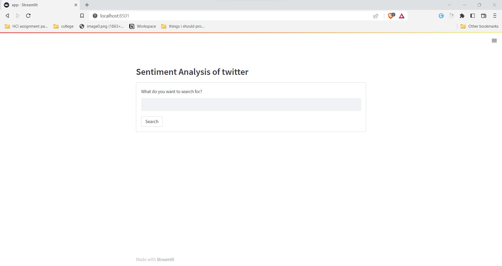
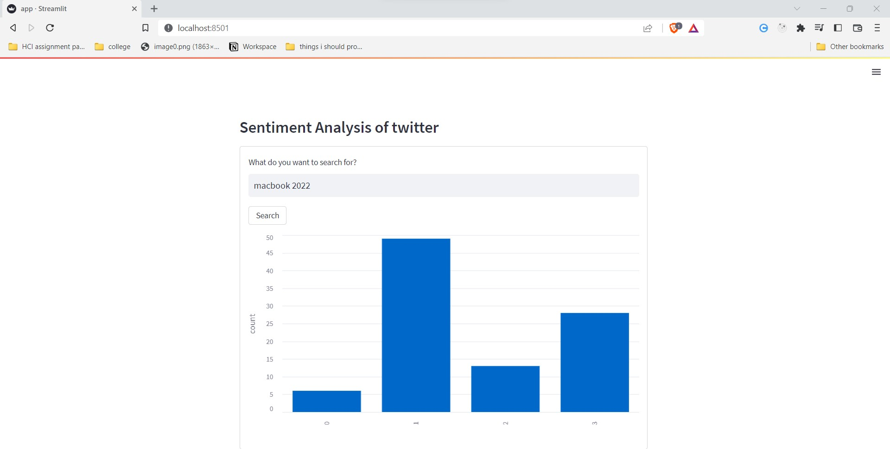

# Sentiment Analysis
Sentiment Analysis made using streamlit and snscrape(for scrapping tweeter)

# Main Page 

# Chart for Sentiment Page 

# Table for Sentiment Page 

# Conclusion
For now when scrapping twitter data we are not considering the nature of tweets. Most of the times, the tweets for the product that has been scraped are just advert of the said product. Manually
checking the scrapped data for sentiment tweets might show better picture of the common words found in negative and positive sentiments. Also, better preprocessing to remove urls, numbers and so on
might also help on the task to extract common words
